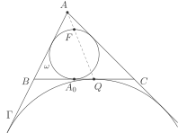

# Факт 1

Дан треугольник \\(ABC\\), вписанная в него в него окружность
\\(\omega\\), касающаяся \\(BC\\) в точке \\(A_0\\), и вневписанная
окружность \\(\Gamma\\), касающаяся стороны \\(BC\\) в точке \\(Q\\). Точка
\\(F\\) диаметрально противоположна точке \\(A_0\\). Тогда точки \\(A\\),
\\(F\\) и \\(Q\\) лежат на одной прямой.

## Рисунок

## Подсказка

Сделайте гомотетию с центром в точке \\(A\\), переводящую
\\(\omega\\) в \\(\Gamma\\).

## Доказательство

Пусть \\(\ell\\) — касательная к \\(\omega\\) в точке \\(F\\).
Сразу отметим, что \\(\ell\\) параллельна \\(BC\\), так как \\(A_0F\\) —
диаметр.

Сделаем гомотетию с центром в точке \\(A\\), переводящую \\(\omega\\)
в \\(\Gamma\\). Тогда \\(\ell\\) перейдёт в \\(BC\\), потому что \\(\ell\\)
должна перейти в касательную к \\(\Gamma\\), параллельную \\(\ell\\) и 
ближнюю к точке \\(A\\), то есть в \\(BC\\). При этом точка касания 
\\(\omega\\) и \\(\ell\\) перейдёт в точку касания их образов, то есть 
в точку касания \\(BC\\) и \\(\Gamma\\). То есть данная гомотетия 
переводит \\(F\\) в \\(Q\\), откуда и следует нужное нам утверждение.
