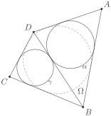

# Факт 2

\\(ABCD\\) — описанный четырехугольник около окружности \\(\Omega\\).
Пусть \\(\alpha\\) и \\(\gamma\\) вписанные окружности треугольников
\\(ADB\\) и \\(CDB\\) соответственно. Тогда \\(\alpha\\) и \\(\gamma\\)
касаются \\(BD\\) в одной точке.

## Рисунок

## Подсказка

Сделайте гомотетию с центром в \\(A\\), переводящую \\(\alpha\\) в
\\(\Omega\\) и гомотетию с центром в \\(C\\), переводящую \\(\gamma\\) в
\\(\Omega\\).

## Доказательство

Обозначим через \\(A\_1\\) и \\(C\_1\\) точки касания \\(BD\\) с
окружностями \\(\alpha\\) и \\(\gamma\\) соответственно. Обозначим длины 
отрезков \\(AB\\), \\(BC\\), \\(CD\\), \\(DA\\), \\(DB\\) за \\(a\\), 
\\(b\\), \\(c\\), \\(d\\), \\(f\\) соответственно. Тогда 
\\[
DA\_1 = \frac{f + d - a}{2}, \\qquad
DA\_2 = \frac{f + c - b}{2}
\\]

Но в таком случае \\(DA\_1 - DA\_2\\) \\(=\\) \\(\dfrac{d + b - a - c}{2}\\)
\\(=\\) \\(0\\), так как \\(a+c\\) \\(=\\) \\(b+d\\) в силу того, что 
четырёхугольник \\(ABCD\\) является описанным. А стало быть \\(A\_1 = 
A\_2\\), это и означает, что окружности \\(\alpha\\) и \\(\gamma\\) касаются
\\(BD\\) в одной точке.
