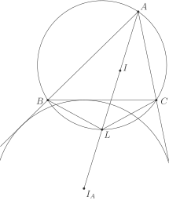
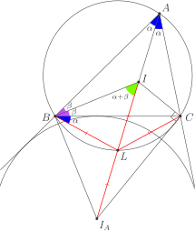

# Факт 6

Введём стандартные обозначения для данного треугольника \\(ABC\\):
\\(\\: \Omega\\) — окружность, описанная около треугольника \\(ABC\\), 
\\(I\\) — центр вписанной окружности, 
\\(I\_A\\) — центр вневписанной окружности напротив вершины \\(A\\).
Пусть \\(AI \cap\\) \\(\Omega =\\) \\(L\\). Тогда \\(IL =\\) \\(LB =\\) 
\\(LC =\\) \\(LI\_A\\). (Лемма о трезубце)

***Примечание.*** Частный случай, когда указывают только равенства 
\\(IL =\\) \\(LB =\\) \\(LC\\), называют также *леммой о трилистнике*. 

## Рисунок

## Подсказка
Так как \\(AL\\) — биссектриса угла \\(A\\), то \\(LB =\\) \\(LC\\)
(равные дуги стягивают равные хорды). Попробуйте доказать 
равнобедренность треугольника \\(IBL\\), а затем посмотрите на 
треугольник \\(ICI\_A\\).

## Доказательство

Пусть угол \\(\angle BAC = 2 \alpha\\), \\(\angle ABC = 2 \beta\\). 
Тогда \\(\angle BIL =\\) \\(\alpha +\\) \\(\beta\\) \\(\big(\\) как внешний к 
треугольнику \\(IBA\\)\\(\big)\\). С другой стороны, \\(\angle IBL =\\) 
\\(\angle IBC +\\) \\(\angle CBL =\\) \\(\angle IBC +\\) \\(\angle CAL =\\) 
\\(\beta + \alpha\\). Следовательно, треугольник \\(BIL\\) — равнобедренный, 
причем \\(BL = IL\\). Итак, мы имеем \\(CL =\\) \\(BL =\\) \\(IL\\). 
Осталось заметить, что треугольник \\(ICI\_A\\) — прямоугольный (угол между 
биссектрисами смежных углов), причём \\(IL =\\) \\(LC\\), из чего и следует 
оставшееся равенство: \\(IL =\\) \\(LB =\\) \\(LC =\\) \\(LI\_A\\). 
<!--(Убедись, что это следствие действительно верно).-->

