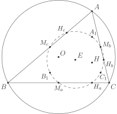
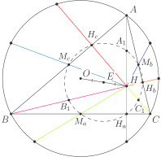

# Факт 9

Пусть дан треугольник \\(ABC\\), \\(H\\) — его ортоцентр; \\(H\_a\\), 
\\(H\_b\\) и \\(H\_c\\) — основания высот из точек \\(A\\), \\(B\\) и 
\\(C\\) соответственно; \\(M\_a\\), \\(M\_b\\) и \\(M\_c\\) — середины 
отрезков \\(BC\\), \\(AC\\) и \\(AB\\) соответственно; \\(A\_1\\), 
\\(B\_1\\) и \\(C\_1\\) — середины отрезков \\(AH\\), \\(BH\\) и 
\\(CH\\) соответственно. Тогда все девять точек \\(H\_a\\), \\(H\_b\\), 
\\(H\_c\\), \\(M\_a\\), \\(M\_b\\), \\(M\_c\\), \\(A\_1\\), \\(B\_1\\), 
\\(C\_1\\) лежат на одной окружности \\(\xi\\), назваемой *окружностью 
Эйлера* или *окружностью девяти точек*. При этом \\(E\\), центр 
окружности \\(\xi\\), лежит на *прямой Эйлера* (см. [далее](fact9.md)) так, что \\(OE = EH\\).

## Рисунок

## Подсказка

Рассмотрите гомотетию с центром \\(H\\) и коэффициентом \\(\dfrac{1}{2}\\).

## Доказательство

Пусть \\(E\\) — середина отрезка \\(OH\\). Покажем, что это и будет 
центром искомой окружности. Для этого сделаем гомотетию с центром 
\\(H\\) и коэффициентом \\(\dfrac{1}{2}\\). Тогда \\(O\\) перейдёт в 
\\(E\\), \\(A\\) в \\(A\_1\\), \\(B\\) в \\(B\_1\\), \\(C\\) в \\(C\_1\\).
Мы также [знаем](../theory/orthocenter.md), что точки, симметричные ортоцентру относительно сторон и 
середин сторон лежат на описанной окружности треугольника \\(ABC\\) и при 
данной гомотетии перейдут в точки \\(H\_A\\), \\(H\_B\\),\\(H\_C\\) и 
\\(M\_A\\), \\(M\_B\\), \\(M\_C\\) соответственно (см. рис. (одинаковым 
цветом обозначены равные отрезки)). Таким образом, данная 
гомотетия переводит окружность \\(\Omega\\) в некоторую окружность \\(\xi\\) 
с центром \\(E\\), которая содержит все девять точек, указанные в условии.
Доказательство закончено. 

### Примечание

Обратите внимание, что мы в ходе наших рассуждений доказали ещё, что радиус 
окружности \\(\xi\\) вдвое меньше радиуса \\(\Omega\\).
