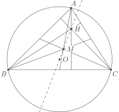
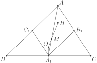

# Факт 10

Пусть дан треугольник \\(ABC\\), 
\\(H\\) — его ортоцентр, 
\\(O\\) — центр описанной окружности, 
\\(M\\) — точка пересечения медиан. Тогда точки \\(O\\), \\(M\\) 
и \\(H\\) лежат на одной прямой, причём \\(2OM = MH\\).

***Примечание.*** Эту прямую называют **прямой Эйлера**. Как было 
доказано в предыдущем факте, прямая Эйлера содержит ценр окружности 
Эйлера.

## Рисунок

## Подсказка
Воспользуйтесь тем, что \\(O\\) — ортоцентр *серединного треугольника* 
\\(ABC\\) (треугольника, вершинами которого являются середины сторон 
треугольника \\(ABC\\)).

## Доказательство

Пусть \\(A\_1\\), \\(B\_1\\), \\(C\_1\\) — середины сторон \\(BC\\), 
\\(AC\\) и \\(AB\\) треугольника \\(ABC\\) соответственно. Заметим, что 
\\(O\\) — ортоцентр треугольника \\(A\_1B\_1C\_1\\). Сделаем гомотетию 
с центром в точке \\(M\\) и коэффициентом \\(-2\\). Тогда эта гомотетия 
переводит \\(A\_1\\) в \\(A\\), \\(B\_1\\) в \\(B\\), \\(C\_1\\) в \\(C\\).
То есть при данной гомотетии треугольник \\(A\_1B\_1C\_1\\) переходит в 
треугольник \\(ABC\\). Тогда \\(O\\) перейдёт в \\(H\\), так как они 
ортоцентры соответствующих треугольников. Значит \\(-2\overrightarrow{MO} = 
\overrightarrow{MH}\\), что и требовалось.

