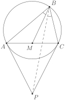
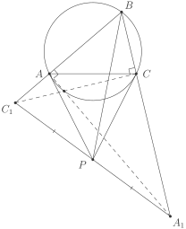
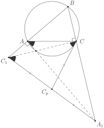

# Факт 4

Пусть \\(\Omega\\) — описанная окружность (остроугольного) треугольника 
\\(ABC\\), \\(a\\) и \\(c\\) — касательные к \\(\Omega\\) в точках 
\\(A\\) и \\(C\\) соответственно. Тогда симедиана угла \\(B\\) 
треугольника \\(ABC\\) проходит через точку пересечения прямых 
\\(a\\) и \\(c\\).

## Рисунок

## Подсказка
Постройте перепендикуляры к \\(AB\\) и \\(BC\\) в точках \\(A\\) и \\(C\\) 
соответственно. Пусть они пересекают прямые \\(BC\\) и \\(AB\\) в точках 
\\(A\_1\\) и \\(C\_1\\) соответственно. Рассмотрите треугольник 
\\(BA\_1C\_1\\). Чем в нём может быть \\(BP \\: ?\\)

## Доказательство

Пусть \\(p\_a\\) и \\(p\_c\\) — перепендикуляры к \\(AB\\) и \\(BC\\) в 
точках \\(A\\) и \\(C\\) соответственно. Пусть также \\(C\_1\\) \\(=\\) 
\\(p\_c \cap AB\\), \\(A\_1\\) \\(=\\) \\(p\_a \cap BC\\). Рассмотрим 
треугольник \\(BA\_1C\_1\\). Сразу заметим, что прямые \\(AC\\) и 
\\(A\_1B\_1\\) антипараллельны относительно прямых \\(AB\\) и \\(BC\\), 
так как в треугольнике \\(BA\_1C\_1\\) точки \\(A\\) и \\(C\\) являются 
основаниями высот. Таким образом, если мы докажем, что \\(P\\) — середина 
\\(C\_1A\_1\\), то мы докажем, что \\(BP\\) — симедиана треугольника 
\\(ABC\\) (см. [теорию](../theory/symmedian.md)), что и требуется. Для 
этого нам достаточно доказать, что каждая из касательных \\(a\\) и \\(c\\) 
проходит через середину \\(C\_1A\_1\\). Докажем для одной одной из них, 
что это так, а для второй рассуждения будут аналогичны.

  

Докажем, что касательная \\(c\\) проходит через середину \\(A\_1C\_1\\).
Пусть \\(c \cap A\_1C\_1\\) \\(=\\) \\(C\_p\\).
По теореме об угле между касательной и хордой имеем: \\(\angle C\_pCC\_1\\) 
\\(=\\) \\(\angle A\_1AC\\). Так как четырёхугольник \\(ACA\_1C\_1\\) 
вписанный, то \\(\angle A\_1AC\\) \\(=\\) \\(\angle CC\_1A\_1\\). Таким 
образом, \\(\angle C\_pCC\_1\\) \\(=\\) \\(\angle A\_1AC\\) \\(=\\) 
\\(\angle CC\_1A\_1\\) \\(=\\) \\(\angle CC\_1C\_p\\), то есть треугольник 
\\(CC\_pC\_1\\) равнобедренный. Но ведь \\(\angle C\_1CA\_1 = 
\{90\}^\{\circ\}\\). А значит \\(C\_p\\) — середина \\(C\_1A\_1\\).

Аналогично доказывается, что и \\(a\\) проходит через середину \\(A\_1C\_1\\). 
Таким образом, мы доказали, что \\(a \cap c\\) \\(=\\) \\(P\\) \\(=\\) 
\\(C\_p\\), то есть \\(P\\) — середина \\(C\_1A\_1\\). В силу вышеописанных 
соображений доказательство закончено.

