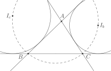
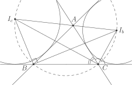

# Факт 7

Пусть \\(I\_b\\) и \\(I\_c\\) — центры вневписанных окружностей 
треугольника \\(ABC\\) напротив вершин \\(B\\) и \\(C\\) соответственно. 
Тогда четырёхугольник \\(I\_bI\_cBC\\) — вписанный.

## Рисунок

## Подсказка

Угол между биссектрисами смежных углов равен \\(\{90\}^\{\circ\}\\)

## Доказательство

 

Заметим, что \\(CI\_c\\) — биссектриса угла \\(\angle ACB\\), а 
\\(CI\_b\\) — биссектриса внешнего угла \\(\angle C\\). То есть 
\\(\angle I\_cCI\_b = \{90\}^\{\circ\}\\). Аналогично: 
\\(\angle I\_cBI\_b = \{90\}^\{\circ\}\\). Таким образом, \\(I\_bI\_cBC\\) 
— вписанный, причём \\(I\_bI\_c\\) — диаметр.
