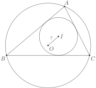
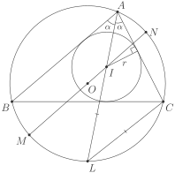

# Факт 8

Пусть дан треугольник \\(ABC\\), описанная около него окружность 
\\(\Omega\\) с центром \\(O\\) и радиусом \\(R\\), вписанная в него 
окружность \\(\omega\\) с центром \\(I\\) и радиусом \\(r\\). Тогда 
\\(\{IO\}^2 = R^2 - 2Rr\\). (формула Эйлера)

## Рисунок

## Подсказка
Проведите \\(IO\\) до пересечения с окружностью \\(\Omega\\), вспомните 
теорему о хордах и попробуйте воспользоваться [*леммой о трелистнике(
трезубце)*](fact6.md).

## Доказательство
 

Пусть \\(AI \cap \Omega = L\\), \\(IO \cap \Omega = \\{M, N \\}\\). 
Тогда \\(MI \cdot NI\\) \\(=\\) \\(AI \cdot IL\\)
\\(\Leftrightarrow\\) \\((R-IO)\\)\\((R+IO)\\) \\(=\\) \\(AI \cdot LI \quad \big(1\big)\\).

Пусть \\(\angle CAB\\) \\(=\\) \\(2\alpha\\) (то есть \\(\angle IAB\\) \\(=\\) \\(\angle IAC\\) 
\\(=\\) \\(\alpha\\)). По теореме синусов \\(LB\\) \\(=\\) \\(2R\\) \\(\cdot\\) \\(\sin \alpha \\). По лемме 
о трилистнике \\(LI\\) \\(=\\) \\(LC\\) \\(=\\) \\(2R\\) \\(\cdot\\) \\(\sin \alpha\\). Мы также знаем, что 
\\(\sin \alpha\\) \\(=\\) \\(\dfrac{r}{AI}\\). Подставляя всё это в \\(\big(1\big)\\), 
получаем, что \\(R^2 - \{IO\}^2\\) \\(=\\) \\((R-IO)\\)\\((R+IO)\\) \\(=\\) 
\\(AI \cdot LI\\) \\(=\\) \\(AI \cdot 2R\\) \\(\cdot\\) \\(\sin \alpha\\) \\(=\\) 
\\(AI \cdot 2R\\) \\(\cdot\\) \\(\dfrac{r}{AI}\\) \\(=\\)
\\(2rR\\) \\(\Leftrightarrow\\) \\(\{IO\}^2\\) \\(=\\) \\(R^2\\) \\(-\\) \\(2Rr\\), 
что и требовалось.
