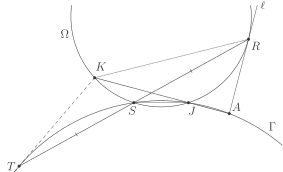
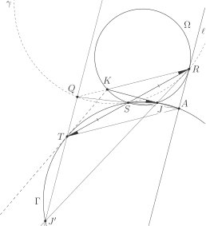

# Задача 1

Пусть \\(R\\) и \\(S\\) — две различные точки на окружности \\(\Omega\\)
такие, что \\(RS\\) не является диаметром. Пусть \\(\ell\\) — касательная
к \\(\Omega\\) в точке \\(R\\). Точка \\(T\\) выбрана так, что \\(S\\) является
серединой отрезка \\(RT\\). Точка \\(J\\) выбрана на меньшей дуге \\(RS\\)
окружности \\(\Omega\\) так, что окружность \\(\Gamma\\), описанная около
треугольника \\(JST\\), пересекает \\(\ell\\) в двух различных точках.
Пусть \\(A\\) — та, из общих точек \\(\Gamma\\) и \\(\ell\\), которая
находится ближе к точке \\(R\\). Прямая \\(AJ\\) вторично пересекает
\\(\Omega\\) в точке \\(K\\). Докажите, что прямая \\(KT\\) касается \\(\Gamma\\).
(IMO 2017, Problem 4)

## Рисунок

## Подсказка 

Сделайте инверсию с центром в точке \\(R\\), переводящую
\\(T\\) в \\(S\\). То есть радиус инверсии будет равен \\(\sqrt{2}  RS\\).

## Доказательство

Пусть \\(O\\) — центр \\(\Omega\\).
Сделаем инверсию с центром \\(R\\), переводящую \\(S\\) в \\(T\\)
\\(\big(\\)т.е. радиус инверсии будет равен \\(\sqrt 2  RS\\)\\(\big)\\).
Тогда, при данной инверсии, окружность \\(\Gamma\\) перейдет в себя,
\\(J\\) перейдет в \\(J' \in \Gamma\\), \\(T\\) в \\(S\\), \\(\ell\\) в себя.
Так как \\(\Omega\\) содержит центр инверсии \\(R\\), то она перейдет в
прямую, содержащие образы точек \\(S\\) и \\(J\\), то есть в прямую \\(J'T\\).
Пусть \\(SA\\) пересекает \\(J'T\\) в точке \\(Q\\). Докажем, что \\(Q\\) — образ
\\(K\\) при данной инверсии. Для этого заметим, что \\(J'T \parallel \ell\\),
так как по свойству инверсии \\(J'T \perp OR\\) и \\(OR \perp \ell\\) в силу
того, что \\(\ell\\) — касательная к \\(\Omega\\).
Из того, что \\(J'T \parallel \ell\\) и \\(ST = RS\\) следует, что \\(TQRA\\) —
параллелограмм. Следовательно, \\(QR \parallel TA\\). Теперь заметим, что
\\(\angle KRS =\\) \\(\angle KJS =\\) \\(\angle STA =\\) \\(\angle RSA\\), 
из чего следует параллельность \\(KR\\) и \\(TA\\), откуда получаем, что 
\\(Q\\), \\(K\\) и \\(R\\)
лежат на одной прямой. Но ведь образом \\(K\\) при инверсии является
пересечение \\(KR\\) и \\(J'T\\), то есть \\(Q\\).

Посмотрим, куда переводит \\(TK\\) данная инверсия. Мы уже знаем, что
\\(T\\) перейдёт в \\(S\\), а \\(K\\) перейдёт в \\(Q\\). Ясно, что \\(TK\\) не
содержит центр инверсии \\(R\\), а значит перейдёт в окружность, содержащую
\\(R\\). Таким образом, \\(TK\\) перейдет в окружность, описанную около
треугольника \\(SQR\\), назовём её \\(\gamma\\). Тогда заметим, что при
гомотетии относительно \\(S\\) с коэффициентом \\(-1\\) \\(R\\) переходит в
\\(T\\), \\(Q\\) в \\(A\\), а \\(S\\) — неподвижна. Следовательно, при данной
гомотетии \\(\gamma\\) перейдёт в \\(\Gamma\\). Значит \\(\gamma\\) и \\(\Gamma\\)
касаются в точке \\(S\\), то есть угол между ними равен нулю. Тогда и угол
между их прообразами равен нулю, то есть угол между \\(KT\\) и \\(\Gamma\\)
равен нулю, а значит, \\(KT\\) касается \\(\Gamma\\), что и требовалось.

### Примечание

Отметим, что в рассуждениях мы нигде не использовали условие
«\\(RS\\) — *не диаметр*», то есть
условие будет выполняться, даже если \\(RS\\) будет диаметром.
Стоит отметить также, что и точка \\(A\\) может быть любой из двух точек
пересечения \\(\Gamma\\) и \\(\ell\\) — решение в обоих случаях будет
аналогично вышеописанному. Более того, даже не обязательно, чтобы общих
точек было две, она может быть и одна, все равно условие будет выполнятся.

