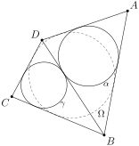
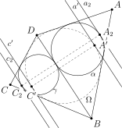

# Факт 2

\\(ABCD\\) — описанный четырехугольник около окружности \\(\Omega\\).
Пусть \\(\alpha\\) и \\(\gamma\\) вписанные окружности треугольников
\\(ADB\\) и \\(CDB\\) соответственно. Тогда \\(\alpha\\) и \\(\gamma\\)
касаются \\(BD\\) в одной точке.

## Рисунок

## Подсказка

Сделайте гомотетию с центром в \\(A\\), переводящую \\(\alpha\\) в
\\(\Omega\\) и гомотетию с центром в \\(C\\), переводящую \\(\gamma\\) в
\\(\Omega\\).

## Доказательство

Обозначим через \\(A\_1\\) и \\(C\_1\\) точки касания \\(BD\\) с
окружностями \\(\alpha\\) и \\(\gamma\\) соответственно. Пусть точки
\\(A\_2\\) и \\(C\_2\\) диаметрально противоположны точкам \\(A\_1\\) и
\\(C\_1\\) соответственно.
Пусть прямые \\(a'\\) и \\(c'\\) — касательные к \\(\Omega\\) в точках
\\(A'\\) и \\(C'\\) и ближние к окружностям \\(\alpha\\) и
\\(\gamma\\) соответственно, причем \\(a' \parallel c' \parallel BD\\).
Определим \\(c\_2\\) и \\(a\_2\\), как касательные к \\(\gamma\\) и
\\(\alpha\\) в точках \\(C\_2\\) и \\(A\_2\\) соответственно.
За \\(R\\), \\(R\_{\alpha}\\), \\(R\_{\gamma}\\) обозначим радиусы
окружностей \\(\Omega\\), \\(\alpha\\) и \\(\gamma\\) соответственно.

Пусть \\(k\_{\alpha} = \dfrac{R}{R\_{\alpha}}\\), \\(k\_{\gamma} =
\dfrac{R}{R\_{\gamma}}\\). Тогда \\(H\_{A}^{k\_{\alpha}}(\alpha) =
\Omega\\), причём \\(H\_{A}^{k\_{\alpha}}(a\_2) = a'\\), так как
\\(a \parallel a\_2\\) и \\(a\\), \\(a\_2\\) касательные. Следовательно,
\\(H\_{A}^{k\_{\alpha}}(A\_2) = A'\\). Аналогично: \\(H\_{C}^{
k\_{\gamma}}(C\_2) = C'\\). Тогда по *теореме о композиции гомотетий*
получаем, что \\(H\_{A}^{k\_{\alpha}} \circ H\_{C}^{k\_{\gamma}} =
H\_{Q}^{k\_Q}\\), где \\(Q\\) — некоторая точка на прямой \\(AC\\), а
\\(k\_Q = k\_{\alpha} k\_{\gamma}\\). Отметим, что \\(k\_Q = k\_{\alpha}
k\_{\gamma} = \dfrac{R^2}{R\_{\alpha} R\_{\gamma}} < 1\\), так как
\\(R > R\_{\alpha}\\) и \\(R > R\_{\gamma}\\). То есть \\(k\_Q \neq 1\\),
а значит \\(H\_{Q}^{k\_Q}\\) именно гомотетия.
