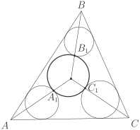

# Задача 4

Каждая из окружностей \\(S\_1\\), \\(S\_2\\) и \\(S\_3\\) касается внешним 
образом окружности \\(S\\) (в точках \\(A\_1\\), \\(B\_1\\), \\(C\_1\\) 
соответственно) и двух сторон треугольника \\(ABC\\). Докажите, что 
прямые \\(AA\_1\\), \\(BB\_1\\), \\(CC\_1\\) пересекаются в одной точке. 
(*Всеросс., 1994, финал, 10*)

## Рисунок

## Подсказка

## Решение
